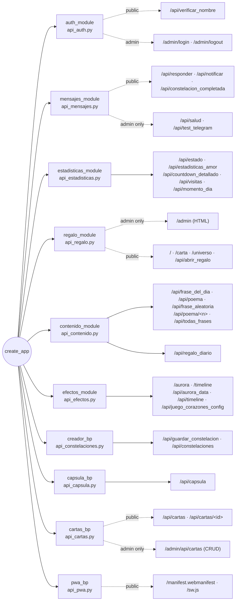
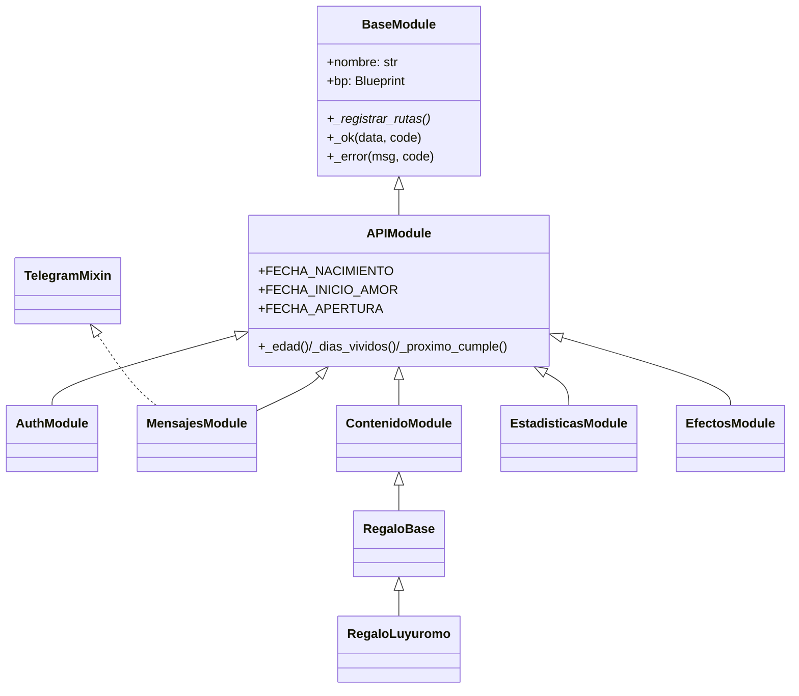
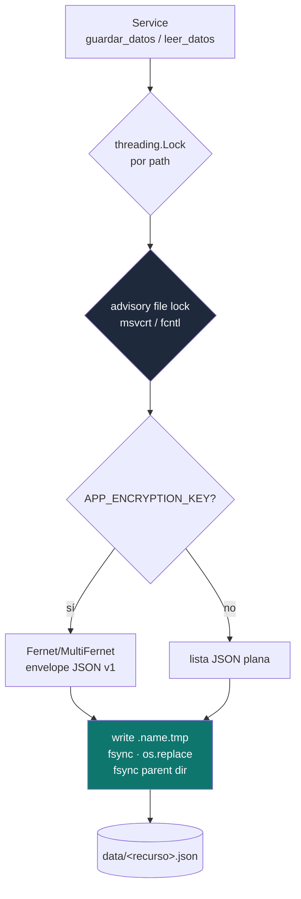
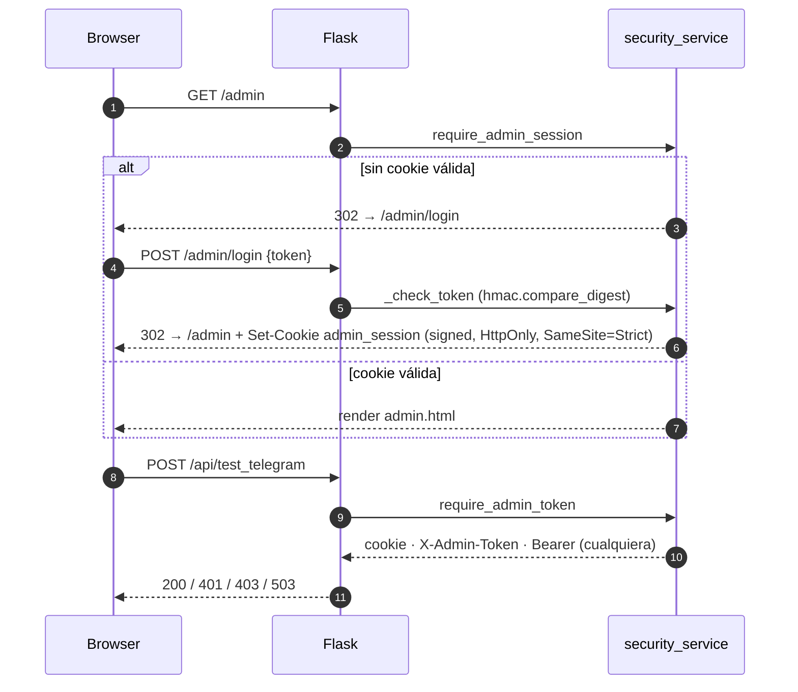

# CLAUDE.md — Mapa mental de cumplea-os

App Flask de regalo de cumpleaños. Vistas inmersivas + APIs JSON + minijuegos.
Despliegue: Railway con Gunicorn. Persistencia: JSON en disco (cifrado opcional).

## Topología de blueprints



## Jerarquía de clases



`api/__init__.py` es la **única** fuente de verdad para `BaseModule` / `APIModule`.
`controllers/__init__.py`, `services/__init__.py` y `models/__init__.py` solo re-exportan.

## Flujo de persistencia (cifrado opcional)



## Flujo de admin (cookie firmada)



`ADMIN_TOKEN` ausente ⇒ 503 (apagado fail-safe, **nunca** abierto).

## Mapa de archivos

| Archivo | Rol |
|---|---|
| [app.py](app.py) | `create_app`, rate-limit, headers, request_id, healthz, contador de visitas, `/api/healthz/details` |
| [api/__init__.py](api/__init__.py) | `BaseModule` (ABC) + `APIModule` (fechas) |
| [services/base_service.py](services/base_service.py) | `ServicioBase` (lock + atomic + crypto envelope + `actualizar(callback)` atómico) |
| [services/crypto_service.py](services/crypto_service.py) | `DataCipher` (Fernet / MultiFernet rotación) |
| [services/security_service.py](services/security_service.py) | `require_admin_token`, `require_admin_session`, cookie firmada, `attach_request_id` |
| [services/metrics_service.py](services/metrics_service.py) | Contadores in-process para `/api/healthz/details` |
| [services/visitas_service.py](services/visitas_service.py) | `ServicioVisitas.registrar()` (atómico, bounded a 365 días) |
| [services/cartas_service.py](services/cartas_service.py) | `ServicioCartas` — cartas selladas con apertura temporizada |
| [services/buzon_service.py](services/buzon_service.py) | Persistencia del buzón secreto |
| [services/capsule_service.py](services/capsule_service.py) | Persistencia + modelo `MensajeCapsula` |
| [services/constelacion_service.py](services/constelacion_service.py) | Persistencia de constelaciones |
| [controllers/api_auth.py](controllers/api_auth.py) | `/api/verificar_nombre` + flujo login/logout admin |
| [controllers/api_mensajes.py](controllers/api_mensajes.py) | Telegram (mixin con retry/backoff + cache de health) + buzón |
| [controllers/api_constelaciones.py](controllers/api_constelaciones.py) | CRUD constelaciones con merge legacy plaintext |
| [controllers/api_capsula.py](controllers/api_capsula.py) | Cápsula del tiempo (mensaje hardcoded del cumple) |
| [controllers/api_cartas.py](controllers/api_cartas.py) | Cartas selladas (CRUD admin + lectura pública según fecha) |
| [controllers/api_pwa.py](controllers/api_pwa.py) | Manifest + service worker para instalación PWA |
| [controllers/api_estadisticas.py](controllers/api_estadisticas.py) | Stats con TTL cache acotado |
| [controllers/api_contenido.py](controllers/api_contenido.py) | Frases + poemas (datos in-source) |
| [controllers/api_efectos.py](controllers/api_efectos.py) | Páginas aurora/timeline + config juego |
| [controllers/api_regalo.py](controllers/api_regalo.py) | Vistas HTML principales + `/admin` (gated) |
| [templates/admin.html](templates/admin.html) | Panel admin — CSP `script-src 'self'`, JS externo |
| [static/js/admin.js](static/js/admin.js) | Lógica del panel admin (sin inline) |
| [tests/](tests/) | `unittest` — 62 tests: smoke, crypto, base_service concurrente, admin auth, visitas, Telegram retry, cartas selladas, regalo diario, PWA |

## Variables de entorno relevantes

| Variable | Default | Crítico si |
|---|---|---|
| `ADMIN_TOKEN` | (vacío ⇒ 503) | Quieres acceder a `/admin` y `/api/test_telegram`. |
| `APP_ENCRYPTION_KEY` | (vacío ⇒ plaintext) | Persistes datos sensibles. Soporta CSV para rotación. |
| `TELEGRAM_TOKEN`, `TELEGRAM_CHAT_ID` | (vacío) | Quieres notificaciones reales. |
| `APP_DATA_DIR` | `.` | Despliegue con volumen montado (ej. `/app/data`). |
| `MAX_CONTENT_LENGTH_BYTES` | `262144` | Límite de subida (responde 413 JSON). |
| `CORS_ALLOWED_ORIGINS` | `*` | Endurecer en prod a CSV de orígenes. |

## Comandos rápidos

```bash
# Test suite completo (36 tests)
python -m unittest discover -s tests -v

# Boot local
python app.py

# Generar ADMIN_TOKEN
python -c "import secrets; print(secrets.token_urlsafe(32))"

# Generar APP_ENCRYPTION_KEY
python -c "from cryptography.fernet import Fernet; print(Fernet.generate_key().decode())"
```

## Invariantes que el reviewer debe preservar

1. **Nunca trackear** `__pycache__/`, `logs/`, `data/*.json`, `.env`. El `.gitignore` lo cubre.
2. **`ADMIN_TOKEN` sin configurar ⇒ 503** en endpoints admin (fail-safe, no fail-open).
3. **Escrituras de `ServicioBase`** son atómicas: `.name.tmp` → `os.replace` → `fsync(parent)`.
4. **`AuthModule.verificar_nombre`** no debe disparar efectos secundarios (anti-spam de Telegram).
5. **`api/__init__.py`** es la única fuente de `BaseModule`/`APIModule` — los otros `__init__.py` solo re-exportan.
6. **Rate limiter** es per-proceso. En Gunicorn multi-worker el límite efectivo se multiplica; para topes duros usar proxy/CDN.
7. **Read-modify-write** sobre disco usa `ServicioBase.actualizar(callback)` — los pares `leer()` + `guardar()` separados pierden updates bajo concurrencia.
8. **Admin frontend** (`templates/admin.html`) corre bajo CSP `script-src 'self'`: nunca añadir `<script>` inline ni handlers `onclick=...` — bind via `data-action` en [static/js/admin.js](static/js/admin.js).
9. **Telegram** se llama exclusivamente via `TelegramMixin._telegram` — provee retry (timeouts y 5xx, hasta 3 intentos, backoff exponencial con jitter; respeta `Retry-After` en 429).
10. **Cartas selladas** se persisten via `ServicioCartas`. La lista pública nunca devuelve cartas con `fecha_apertura` futura — esa garantía es el corazón del feature; no añadir un atajo de admin que la vulnere.
11. **Regalo diario** (`/api/regalo_diario`) es determinista por fecha (seed = `date.today().toordinal()`). Si cambias el algoritmo, considera que Luna puede haber visto el resultado de hoy ya — pruébalo manualmente.
12. **PWA**: `/sw.js` debe servirse desde la raíz con `Service-Worker-Allowed: /`. Si lo mueves a `/static/`, su scope queda restringido y deja de funcionar offline.
